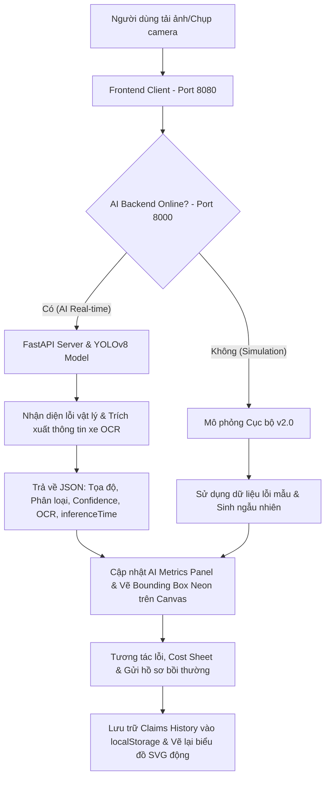

# InsurVision Sentinel v2.0 🚗🧠💎
### Next-Gen AI Claims Engine & Premium SVG Analytics Dashboard

**InsurVision Sentinel v2.0** là một giải pháp công nghệ tiên phong (InsurTech) ứng dụng **Thị giác máy tính (Computer Vision)** và **Trí tuệ nhân tạo (AI)** vào quy trình tự động hóa giám định tổn thất và ước tính chi phí bồi thường bảo hiểm xe hơi từ hình ảnh hiện trường thực tế.

Dự án được nâng cấp toàn diện lên phiên bản **v2.0 (Sentinel)** với ngôn ngữ thiết kế Obsidian Dark Mode cao cấp, hệ thống đo lường hiệu năng AI thời gian thực và các biểu đồ phân tích thống kê SVG sống động 60fps.

---

## 💎 Các Tính Năng Nổi Bật Trên Phiên Bản v2.0

*   **Giao diện Obsidian Glassmorphism:** Thiết kế kính mờ cao cấp với chiều sâu không gian huyền ảo, bóng đổ neon và các viền phát sáng mỏng tương tác động khi di chuột qua.
*   **Bảng Đo Lường AI Thời Gian Thực (AI Metrics Panel):** Hiển thị trực quan hiệu năng phần cứng trên máy tính:
    *   *Trạng thái Engine:* Pulse dot nhấp nháy động báo `AI ONLINE` (đang kết nối Backend) hoặc `OFFLINE` (chế độ mô phỏng).
    *   *Inference Latency:* Độ trễ suy luận AI tính chính xác bằng mili-giây (`ms`).
    *   *Processing Device:* Tự động nhận diện thiết bị xử lý (`NVIDIA GPU CUDA` hoặc `Local CPU`).
*   **Dải Quét Laser Đa Sắc (Gradient Laser Scanner):** Dải quét chuyển màu mượt mà từ Cyan qua Indigo đến Violet phát sáng neon chạy dọc màn hình khi AI thực hiện phân tích kết cấu vật lý.
*   **Interactive Graphics Canvas:** Cho phép click lựa chọn lỗi trực quan trên ảnh, thay đổi phương án khắc phục (Sửa/Thay thế phụ tùng), tự vẽ khoanh vùng lỗi thủ công (drag-to-draw) để hệ thống tự động tính toán lại chi phí.
*   **Biểu Đồ Phân Tích SVG Thuần (100% Native SVG Charts):**
    *   *Damage Distribution (Donut Chart):* Tự động tính toán góc xoay hình tròn và phân bổ phần trăm linh kiện bị hỏng (`Bumper`, `Windshield`, `Door`...) rực rỡ sắc màu, hỗ trợ hover co giãn neon mượt mà.
    *   *Claims Status (Bar Chart):* Biểu đồ cột đứng biểu thị tỷ lệ hồ sơ duyệt bồi thường (`Đang xử lý`, `Đã duyệt`, `Đã chi trả`) gối trên lưới tọa độ với hiệu ứng dâng cao sinh động.

---

## 🛠️ Kiến Trúc Hệ Thống & Sơ Đồ Vận Hành

Hệ thống được thiết kế theo mô hình Client-Server tối ưu với tính năng **tự động phục hồi (Self-Healing)** để đảm bảo luồng nghiệp vụ luôn chạy ổn định:



---

## 🚀 Hướng Dẫn Cài Đặt & Chạy Dự Án

Dự án gồm 2 thành phần chính chạy song song trên máy tính của bạn:

### 1. Khởi động AI Backend Server (Cổng 8000)
Máy chủ xử lý AI viết bằng Python sử dụng FastAPI và YOLOv8m.

```bash
# Di chuyển vào thư mục backend
cd backend

# Khởi tạo môi trường ảo (Nếu chưa có)
python -m venv .venv

# Kích hoạt môi trường ảo
# Trên Windows (PowerShell):
.\.venv\Scripts\Activate.ps1
# Trên macOS/Linux:
source .venv/bin/activate

# Cài đặt các thư viện thiết yếu
pip install -r requirements.txt

# Khởi động máy chủ uvicorn
python -m uvicorn server:app --host 0.0.0.0 --port 8000
```

### 2. Khởi động Frontend Client (Cổng 8080)
Máy chủ web tĩnh phục vụ giao diện HTML5/CSS/JS.

```bash
# Đứng tại thư mục gốc của dự án (d:\CVBH)
# Khởi động server static (Sử dụng Node http-server hoặc python http.server)
npx -y http-server -p 8080

# Hoặc dùng Python để chạy thay thế nếu không có Node:
python -m http.server 8080
```

Sau khi cả 2 máy chủ đã khởi động, bạn mở trình duyệt và truy cập:
👉 **[http://localhost:8080](http://localhost:8080)**

*(Hãy nhấn tổ hợp phím **Ctrl + F5** hoặc **Cmd + Shift + R** để xóa bộ nhớ đệm cũ khi truy cập lần đầu nhằm hiển thị đúng giao diện v2.0).*

---

## 📂 Danh Mục Cấu Trúc File Nguồn

```text
d:\CVBH\
├── index.html          # File giao diện SPA chính, chứa bố cục HTML5 & SVG Chart nodes.
├── css/
│   └── styles.css      # Thiết kế CSS cao cấp (Glassmorphism, scan gradient, charts animations).
├── js/
│   ├── app.js          # Bộ điều phối trung tâm, xử lý Blob gửi AI Backend, lập trình vẽ SVG Charts.
│   ├── canvas.js       # Vẽ Bounding Box phát sáng, quản lý click chọn lỗi & vẽ vùng thủ công.
│   └── data.js         # Bảng giá bảo hiểm, cơ sở dữ liệu mô phỏng, lưu trữ localStorage.
├── assets/             # Hình ảnh mẫu hư hỏng linh kiện và logo.
├── backend/
│   ├── server.py       # API FastAPI nhận diện va chạm YOLOv8m & AI OCR.
│   ├── requirements.txt# Các thư viện phụ thuộc Python.
│   └── run_backend.ps1 # Script tự động kích hoạt môi trường ảo chạy Backend.
└── .gitignore          # File bảo vệ Git, loại bỏ các thư mục nặng như .venv và tệp trọng số *.pt.
```

---

## 🧠 Tích Hợp Mô Hình AI YOLOv8 Chuyên Dụng

Hệ thống sử dụng mô hình học sâu **`CharbelMsalem/yolov8m-finetuned-datamatics-damage`** được huấn luyện chuyên sâu để phát hiện và định dạng 6 loại lỗi va chạm chính:
*   `dent` (Móp méo vỏ kim loại)
*   `scratch` (Trầy xước sơn)
*   `glass_shatter` (Nứt vỡ kính)
*   `lamp_broken` (Hỏng cụm đèn pha)
*   `crack` (Nứt gãy nhựa/composite)
*   `tire_flat` (Xẹp lốp/hỏng bánh)

---

## 📝 Bản Quyền & Phát Triển
*   **Phát triển bởi:** Dreuss11 & Antigravity (Advanced Agentic AI Coding Assistant từ Google DeepMind team).
*   **Giấy phép:** MIT License.
